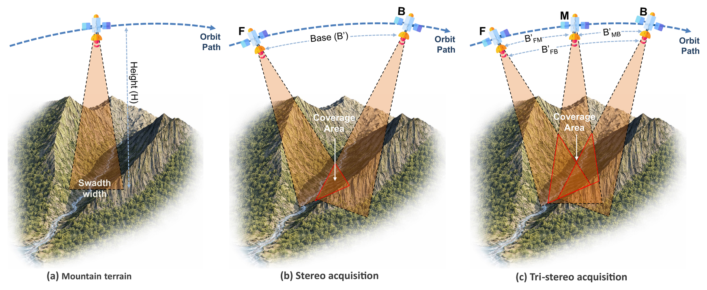
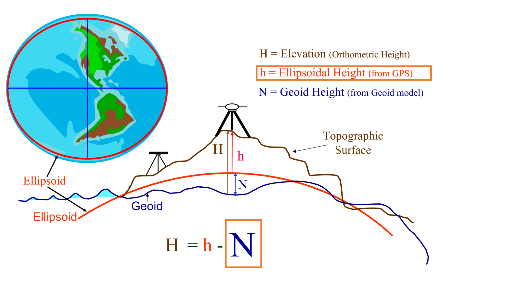

# Pléiades ASP Workflow

**Release v1.5.4**

A reproducible **Python- and Jupyter-based research-software workflow** for generating high-resolution digital surface models (DSMs) from **Pléiades, Pléiades NEO, and SPOT 6/7** optical stereo imagery using the **NASA Ames Stereo Pipeline (ASP)**.

- The guided Jupyter interface supports the complete DSM-generation workflow, including image preparation, metadata and stereo-geometry inspection, reference-DEM preparation, ASP pre-processing and map projection, point-cloud reconstruction, final DSM generation, and optional LiDAR-based co-registration.

- The software is implemented primarily in **Python**, with **Jupyter notebooks and interactive controls** used to manage processing parameters, execution, quality control, and outputs across the three supported satellite sensors.

For reproducibility of the associated study, the reference processing version is **Ames Stereo Pipeline 3.3.0**.

## What this package provides

- Guided preparation of Pléiades / Pléiades NEO / SPOT imagery and metadata.
- Support for stereo and tri-stereo acquisitions.
- Strict DIMAP tile handling, including `R1C1` anchor validation for tiled products.
- Metadata and stereo-geometry inspection.
- DIM-versus-RPC camera-model consistency diagnostics.
- Reference-DEM preparation using IGN LiDAR HD, Copernicus GLO-30, SRTM1, or an existing DEM.
- Vertical-reference handling for ellipsoidal / geoid-based DEM conversion.
- Restartable ASP pre-processing:
  - `bundle_adjust`
  - preliminary `parallel_stereo`
  - preliminary `point2dem`
  - `pc_align`
  - camera-transform propagation
  - `mapproject`
- Point-cloud reconstruction and final DSM generation.
- Optional co-registration in a separate xDEM notebook.
- Runtime summaries and Run / Pause / Resume / Stop controls for long processes.
- Original scientific notebooks retained under `original_notebooks/` for traceability.

## Installation

Python **3.10 or newer** is required; Python 3.11 is recommended.

Create a clean environment:

```bash
conda create -n pleiades_asp python=3.11 pip -y
conda activate pleiades_asp
```

### Install from the downloaded/research archive

After extracting this archive, enter the package directory and run:

```bash
python -m pip install .
asp-install 3.3.0
pleiades-workflow-init
```

### Install from the development Git repository

When the Git repository is accessible, the same setup can be performed with:

```bash
python -m pip install git+https://github.com/IslamKOA/pleiades-asp-workflow.git
asp-install 3.3.0
pleiades-workflow-init
```

`asp-install` automatically retrieves the requested ASP binary release from the official **NeoGeographyToolkit/StereoPipeline** release source and installs/configures it in the workflow's separate managed ASP location. ASP is **not bundled inside this repository/archive**, and no manual ASP download/configuration is required when using this installer.

The notebook workspace is created at:

```text
~/Pleiades_ASP_Workflow/
```

Launch the public interface with:

```bash
jupyter lab ~/Pleiades_ASP_Workflow/Pleiades_ASP_Workflow.ipynb
```

Then click:

```text
▶ Start Pléiades ASP Workflow
```

### ASP documentation

The scientific processing engine used by this workflow is the NASA Ames Stereo Pipeline. For ASP command definitions, camera models, stereo sessions, and detailed processing behavior, consult the official documentation:

- ASP documentation: https://stereopipeline.readthedocs.io/en/latest/
- ASP source repository: https://github.com/NeoGeographyToolkit/StereoPipeline
- Pléiades processing example: https://stereopipeline.readthedocs.io/en/latest/examples/pleiades.html

This workflow provides a tested orchestration and quality-control layer around ASP; it does not replace the ASP documentation.

## Workflow

```text
1. Prepare data
   ↓
2. Metadata and geometry
   ↓
3. Pre-processing
   ├─ Reference DEM preparation and QC
   ├─ Bundle adjustment
   ├─ Preliminary stereo
   ├─ Preliminary DSM
   ├─ Reference alignment (pc_align)
   ├─ Camera transform
   └─ Map projection
   ↓
4. Point-cloud reconstruction
   ↓
5. Final DSM generation
   ↓
6. Optional co-registration (outside ASP; xDEM notebook)
```

The interface preserves the tested scientific processing sequence while keeping the intended parameters user-configurable.

## Prepare data and tiled DIMAP products



For tri-stereo projects, the three input folders are temporary labels during initial preparation. The **Metadata and geometry** step reads acquisition times from DIMAP metadata and normalizes the prepared views to:

```text
earliest acquisition  -> A = Forward (F)
middle acquisition    -> B = Middle / near-nadir (M)
latest acquisition    -> C = Backward (B)
```

Prepared TIFF, RPC XML, DIM XML, VRT, and optional AOI-cropped products are relabeled consistently. The resulting view assignment is saved under `metadata/*_view_assignment.csv`.

For tiled DIMAP products, `R1C1` is treated as the anchor tile. If the required image extends into additional tiles, enable **Merge selected image tiles** and include `R1C1` together with all required additional tile IDs. The interface blocks invalid tile selections rather than silently preparing a later tile alone.

## Resume an existing project

`Prepare data` writes the project configuration to `project_settings.json`.

Use **Load / resume existing project** to restore:

- original acquisition-folder paths;
- project name and output location;
- acquisition mode and platform;
- tile selections;
- AOI/crop settings;
- prepared image previews;
- metadata products;
- reference DEM paths and QC displays;
- completed ASP pre-processing products;
- bundle-adjustment tables;
- preliminary DSM information and preview;
- `pc_align` diagnostics and transformation matrix;
- camera-transform results;
- map-projected image tables and previews;
- point-cloud reconstruction products;
- final DSM tables and previews.

Loading an existing project **does not rerun ASP**. Later pre-processing stages may reuse compatible prerequisite products already present on disk, so users do not need to rerun the immediately preceding stage merely because the notebook was closed and reopened.

**Start new project / clear form** resets only the notebook/interface state. It does not delete project outputs or source imagery from disk.

## Reference DEM preparation

The workflow distinguishes two reference roles:

1. **Alignment reference DEM** — used by `pc_align`.
2. **Map-projection DEM** — used by `mapproject`.

For mainland France, the default starting configuration used in the study is:

```text
Alignment reference:      IGN LiDAR HD
Alignment resolution:     1 m
Map-projection reference: IGN LiDAR HD
Map DEM resolution:       50 m
Vertical model:           RAF20
```

Copernicus GLO-30 and SRTM1 are also supported as global alternatives. When one global DEM is selected for the alignment workflow, the interface can reuse the same prepared ellipsoidal DEM for map projection.

Reference DEM QC reports CRS, resolution, extent, elevation range, valid coverage, and the vertical-correction raster when applicable.

Vertical conversion follows:

```text
N = h - H
h = H + N
H = h - N
```

where `h` is ellipsoidal height, `H` is orthometric height, and `N` is geoid/quasi-geoid separation.



## ASP pre-processing

The tested sequence is:

```text
Reference DEM QC
→ bundle_adjust
→ preliminary parallel_stereo
→ preliminary point2dem
→ pc_align
→ apply alignment transform to adjusted cameras
→ mapproject
```

The reproducibility defaults used by the study include:

```text
Camera model / ASP session          RPC / -t rpc
Bundle-adjust robust threshold      2
Bundle-adjust max iterations        500
Bundle-adjust cost function         Cauchy
Preliminary algorithm               BM — asp_bm
Preliminary CK:SK                   35:45
Preliminary cost mode               2
Preliminary xcorr threshold         2
Correlation memory                  10240 MB
Correlation tile size               3200
Subpixel mode                       2
Preliminary DSM resolution          1.0 m
Preliminary DSM nodata              -9999
pc_align max displacement           250 m
pc_align iterations                 100
Mapproject threads                  18
Map-projected image resolution      0.5 m
```

These values are starting settings from the associated study, not universal optima. Sensor characteristics, acquisition geometry, terrain, illumination, shadow, and computational resources may justify different values.

### Camera models

The public workflow supports:

```text
RPC — reproducibility default
  ASP session: -t rpc
  Camera files: RPC_A.XML / RPC_B.XML / RPC_C.XML

Pléiades exact linescan — optional
  ASP session: -t pleiades
  Camera files: DIM_A.XML / DIM_B.XML / DIM_C.XML
```

The selected camera representation is propagated consistently through the camera-dependent ASP stages. Exact DIM processing should use full prepared images because the optional AOI crop updates RPC offsets but does not reparameterize the exact DIM linescan model for the cropped raster.

## Point-cloud reconstruction and final DSM

The interface supports stereo-pair processing and tri-stereo configurations built from the available image pairs. Full tri-stereo merged reconstruction uses pairwise point clouds followed by `pc_merge`.

Tested final DSM starting values include:

```text
Final DSM resolution                  1 m
Maximum valid triangulation error     1 m
```

The interface reports output products, reconstruction diagnostics, previews, and per-stage runtime information.

## Optional co-registration

Co-registration is intentionally kept outside ASP as the final optional workflow stage.

After Final DSM generation, the interface provides **Open optional co-registration notebook**. It writes `coregistration_handoff.json` in the active project folder and opens:

```text
coregistration/Coregistration_Process-Final-withPlannimetric.ipynb
```

The notebook contains the latest xDEM / Nuth & Kääb workflow used during development. Review its **INPUTS** cell before execution, especially the final DSM, external reference DEM, and stable-area inputs.

## Original scientific notebooks

The archive contains:

```text
src/pleiades_asp_workflow/interface_bundle/original_notebooks/
```

These notebooks preserve the original scientific development/testing workflow. They are retained for transparency and traceability and are separate from the streamlined public interface.

## Outputs

Project figures are written under:

```text
<Project>/Figure/
```

Typical saved outputs include:

- prepared/cropped image previews;
- alignment-reference DEM QC;
- map-projection DEM QC;
- geoid/vertical-reference QC;
- preliminary DSM preview;
- map-projected image QC;
- DIM-versus-RPC comparison figure;
- final DSM preview.

Graphical QC products are generally saved as both PNG and PDF when supported by the relevant stage.

## Supported ASP commands

The managed ASP bridge exposes the commands used by this workflow:

```text
bundle_adjust
parallel_stereo
point2dem
pc_align
mapproject
cam_test
pc_merge
dem_geoid
```

## Installation and environment checks

Inspect the configured ASP installation with:

```bash
asp-version
asp-info
asp-doctor
pleiades-workflow-info
```

Refresh an existing notebook workspace after updating the package:

```bash
pleiades-workflow-init --force
```

On Windows, ASP runs through Linux/WSL. The package contains a Windows-to-WSL bridge for the managed ASP installation.

Python dependencies such as `rpcm` and `xdem` are installed through the workflow package dependencies; they do not require separate manual installation when the package is installed normally.

## Installed workspace

The generated workspace contains the public notebook and the runtime modules/assets required by the interface, including:

```text
~/Pleiades_ASP_Workflow/
├── Pleiades_ASP_Workflow.ipynb
├── asp_utils2.py
├── prepare_stereo_metadata_and_geometry.py
├── pleiades_reference_dem.py
├── global_dem_downloader.py
├── ign_lidarhd_downloader.py
├── vertical_reference.py
├── requirements_interface.txt
├── coregistration/
├── original_notebooks/
├── figures/
├── examples/
└── data/
```

## Data and redistribution

This interface archive does **not** include the original Pléiades, Pléiades NEO, or SPOT 6/7 satellite image products. Those datasets remain subject to the applicable Airbus DS / DINAMIS access and licensing conditions.

## Third-party software

ASP is a separate dependency developed at NASA Ames Research Center and distributed under the **Apache License 2.0**. The supplied `asp-install` command automatically retrieves/configures the selected ASP release from the official ASP release source; ASP source code and binaries are not bundled in this workflow archive.

See [`THIRD_PARTY_NOTICES.md`](THIRD_PARTY_NOTICES.md) for attribution and redistribution notes relevant to ASP and other external components.

## Citation

### Associated manuscript

> **Koa, I., Recking, A., & Borgniet, L.** *A Reproducible End-to-End Ames Stereo Pipeline Workflow for Generating Pléiades Tri-Stereo DSMs in High-Relief Terrain*. Manuscript under revision for **Earth and Space Science (AGU)**.

### Research software

The archived version of **Pléiades ASP Workflow** is available through **Research Data Gouv**.

> **Koa, I., Recking, A., & Borgniet, L. (2026).** *Pléiades ASP Workflow* (Version 1.5.4). Research software. **Research Data Gouv**.  
> DOI: **[Research Data Gouv DOI to be added]**

## License

This software is distributed under the **CeCILL-B Free Software License Agreement** (`CECILL-B`).

See the [LICENSE](LICENSE) file for the full license text.

Third-party software and data remain governed by their own terms regardless of the license ultimately selected for this workflow.
